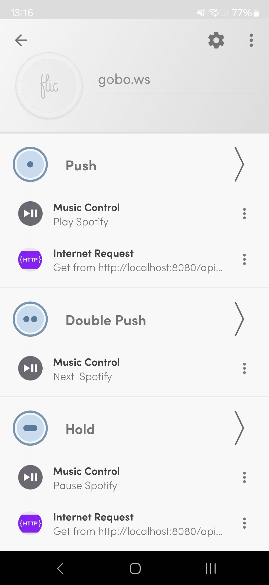

# Dansstopp 2025

When you bring Astera fixtures to your daughter's birthday party but want to keep things simple, you can use the **Astera Android app** and a **Flic button**, thanks to Astera's remote API, instead of setting up CRMX.  

With a **Flic button**, you can **pause the music** while simultaneously **triggering the scene "Just Red"** for the game *Freeze Dance* (*Dansstopp* in Swedish)  

## Steps  

1. **Install the Flic app**  
2. **Install the Astera app**  
3. **Enable Remote Control** in the Astera app  
4. **Configure the Flic app:**  
   - Add an **Internet Request** for **Push**, using `GET` with the URL:  
     ```plaintext
     http://localhost:8080/api/launch?uuid=***
     ```
     *(Find the corresponding UUID on the Astera API website at `http://localhost:8080`)*  
   - Use **Music Control - "Play Spotify"** if using Spotify  
   - Add **Music Control - "Next Spotify"** for **Double Push** 
   - Add **Music Control - "Pause Spotify"** and an **Internet Request** (`GET`) from the URL:  
     ```plaintext
     http://localhost:8080/api/launch?uuid=***
     ```
     *(Find the corresponding UUID for the scene "Just Red" on the Astera API website)*

       

---

### Additional Notes  
- Ensure the **Astera app** is running for the API commands to work
- If you're using **Spotify**, make sure it's configured correctly in the Flic app
- You can modify the **UUID** in the URL to trigger other lighting scenes
